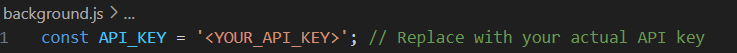
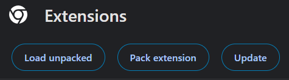
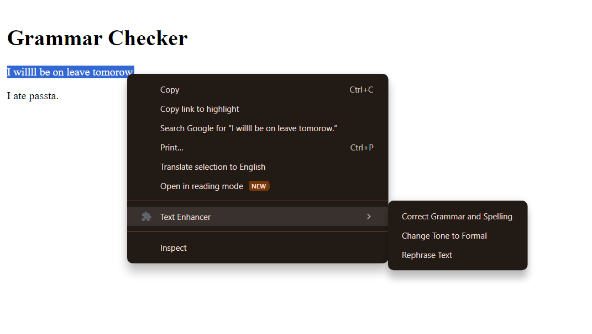
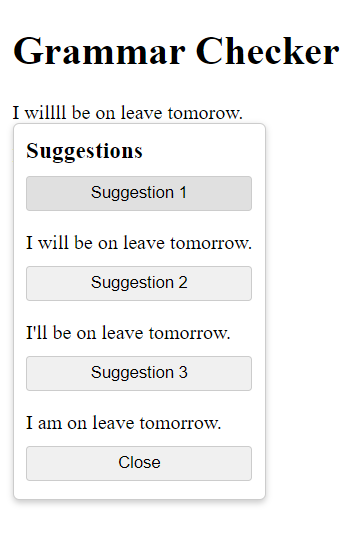
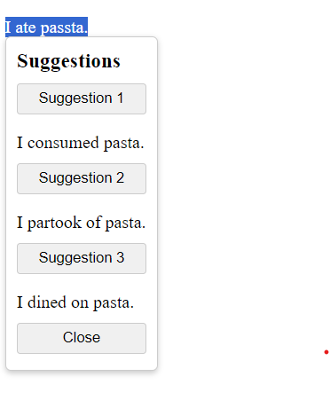
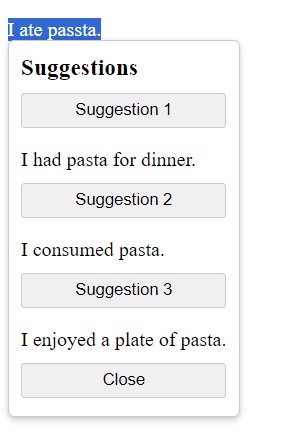

# AiTextPolish

A chrome extension that uses Gemini to polish your text.

- Grammar correction
- Rephrase Sentences
- Add a Formal Tone

### Requirements

- Chrome Browser
- Gemini API Key

### Installations
- Clone this Repo
```
$ git clone https://github.com/RishuSUkhija017/AiTextPolish.git
```

- Replace the API key in background.js file

 


- Open Extensions tab on Google Chrome


- Enable Developer Mode (Top Right)

    


- Click on Load Unpacked

    


- Select the Repo Folder


### Usage

- Select the text that you want to Polish and right click.

    

- To correct the spelling/grammar, click on "Correct Grammar and Spelling"

   

- To "Change Tone to Formal", click on the second option

    

- To "Rephrase text", click on the third option

    

- You can click on any of the suggestions to replace the original text.

